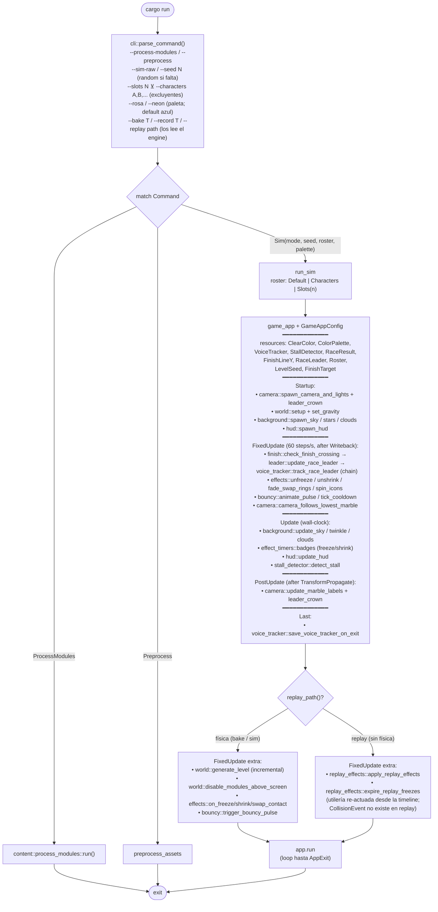
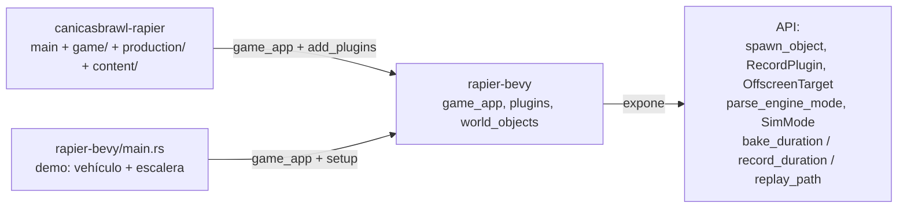
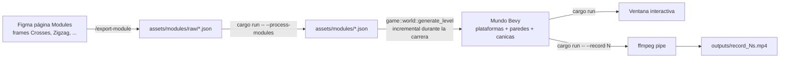
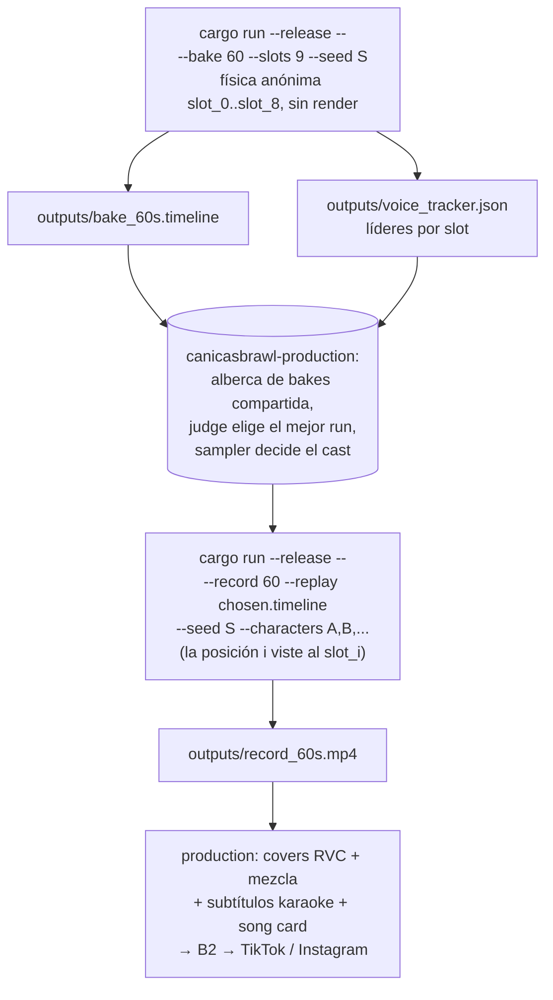
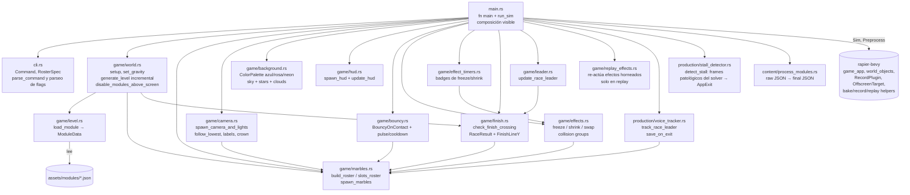

# Flujos del repo

Diagramas vivos. Cuando el código cambie, corre `/update-flow` y Claude actualiza esto.

## 1. Flowchart de `main`

`run_sim` es una función en `main.rs` — todo lo que se ve arriba **vive en `main.rs` literal**, no escondido en un Plugin. Cmd+click sobre cualquier nombre de system salta a su implementación.

`--bench` no es modo del juego. Para correrlo: `cd ../rapier-bevy && cargo run -- --bench falling-spheres 200`. El bench es herramienta del engine para probar features, no del juego.

## 2. Composición engine ↔ juego

El engine no conoce a ningún juego. Cada juego (canicasbrawl, demo) pone su propia cámara, luces, sistemas y resources.

## 3. Pipeline editor → juego

## 4. Pipeline producción de video (bake anónimo → casting → replay vestido)

Este repo es **uno de los dos juegos** que orquesta `~/canicasbrawl-production`
(el otro es `~/musical-path-rapier`). El contrato: producir timeline +
voice_tracker (bake) y un mp4 crudo (record); todo lo demás (covers RVC,
mezcla, subtítulos, card, B2, publicación) vive en production.

Detalle del contrato bake/replay en la sección "Contrato bake/replay" de
`CLAUDE.md`.

## 5. Pipeline general (materializado en canicasbrawl-production)

El "pipeline futuro" que vivía aquí ya existe: es el repo
`~/canicasbrawl-production` (discovery → planner → runs → audio → video →
publisher, con feedback de métricas al planner). Sus diagramas viven en
`~/canicasbrawl-production/docs/flow.md`; este repo solo aporta el área `runs`.

## 6. Módulos del juego

`main.rs` referencia directamente cada system por su ruta completa (`game::camera::spawn_camera_and_lights`, `production::voice_tracker::track_race_leader`, etc.). `game/mod.rs` y `production/mod.rs` son solo organizadores de namespace — sin Plugin ni función de composición.
