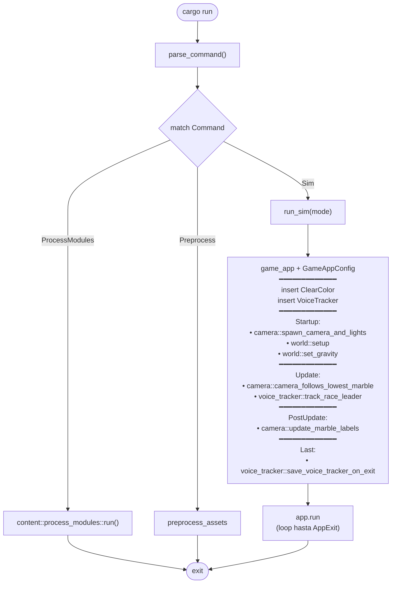
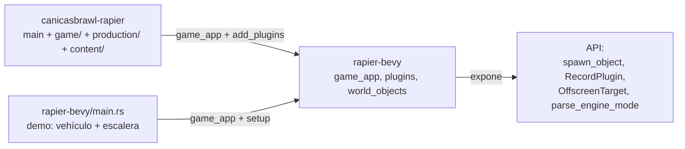
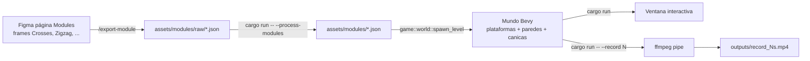
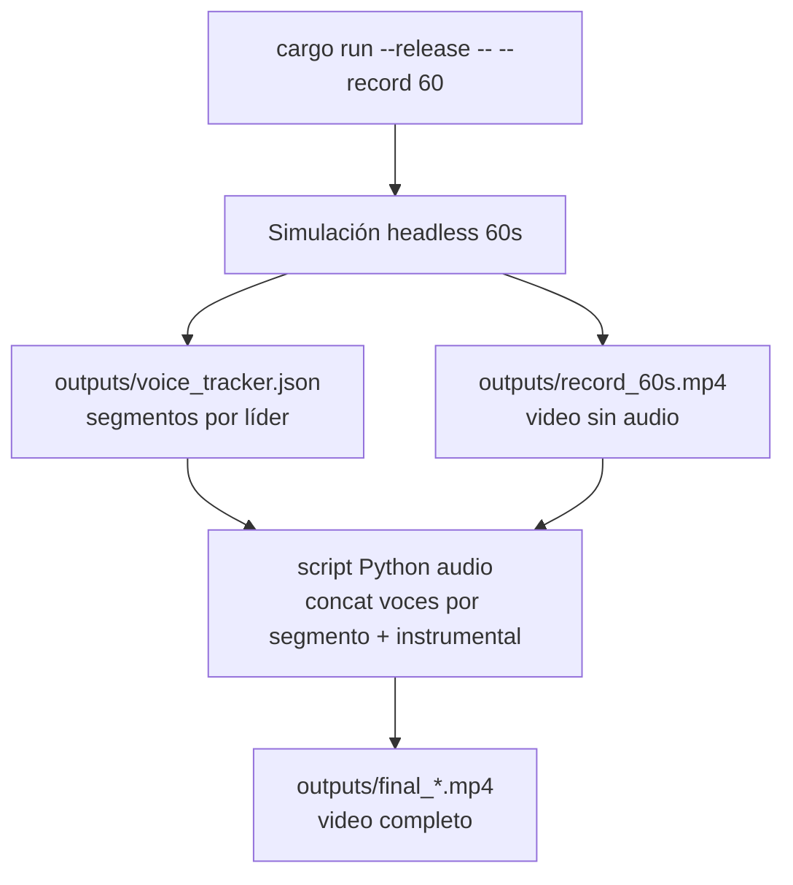
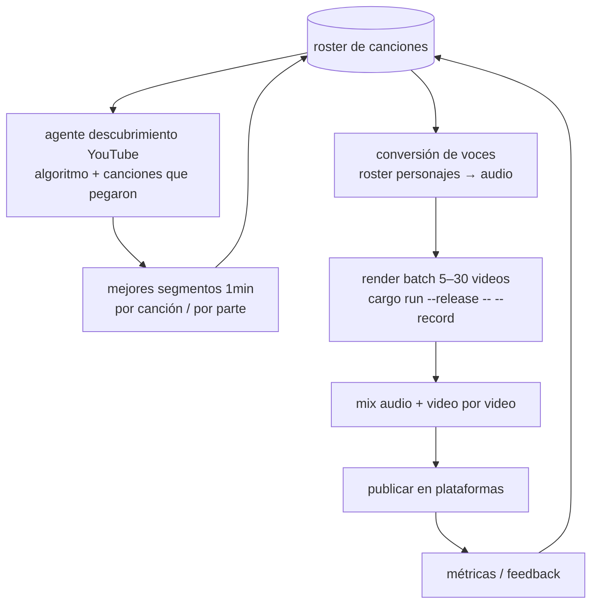
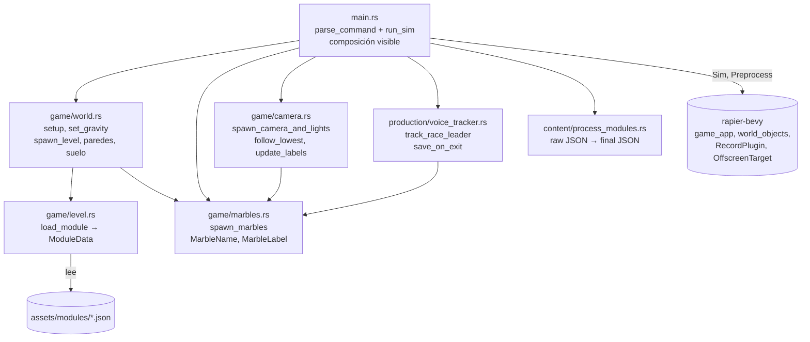

# Flujos del repo

Diagramas vivos. Cuando el código cambie, corre `/update-flow` y Claude actualiza esto.

## 1. Flowchart de `main`

`run_sim` es una función en `main.rs` — todo lo que se ve arriba **vive en `main.rs` literal**, no escondido en un Plugin. Cmd+click sobre cualquier nombre de system salta a su implementación.

`--bench` no es modo del juego. Para correrlo: `cd ../rapier-bevy && cargo run -- --bench falling-spheres 200`. El bench es herramienta del engine para probar features, no del juego.

## 2. Composición engine ↔ juego

El engine no conoce a ningún juego. Cada juego (canicasbrawl, demo) pone su propia cámara, luces, sistemas y resources.

## 3. Pipeline editor → juego

## 4. Pipeline producción de video (estado actual)

## 5. Pipeline producción de video (futuro)

## 6. Módulos del juego

`main.rs` referencia directamente cada system por su ruta completa (`game::camera::spawn_camera_and_lights`, `production::voice_tracker::track_race_leader`, etc.). `game/mod.rs` y `production/mod.rs` son solo organizadores de namespace — sin Plugin ni función de composición.
