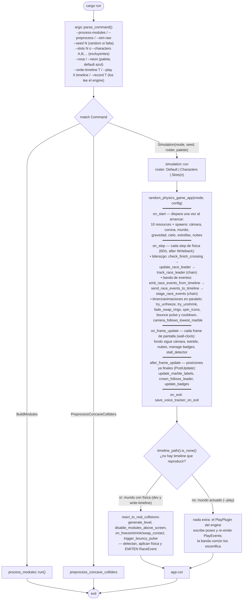
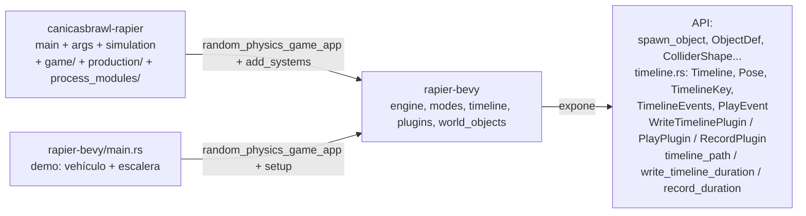
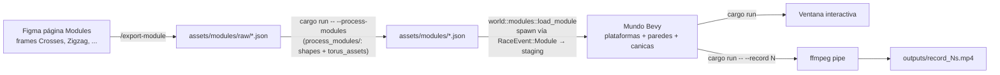
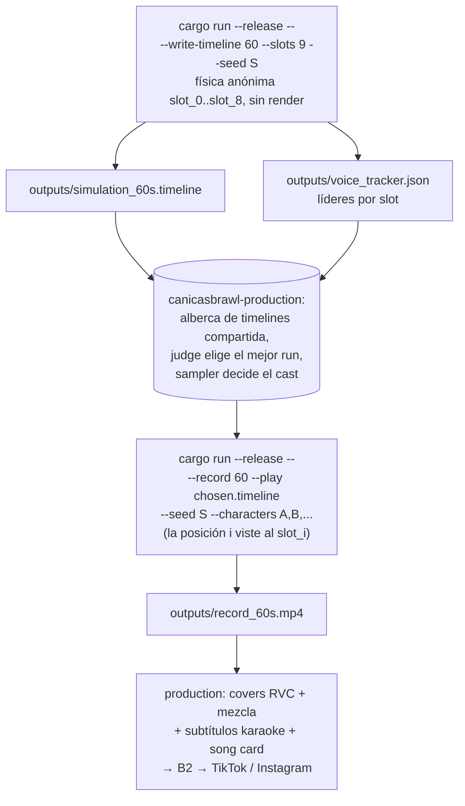
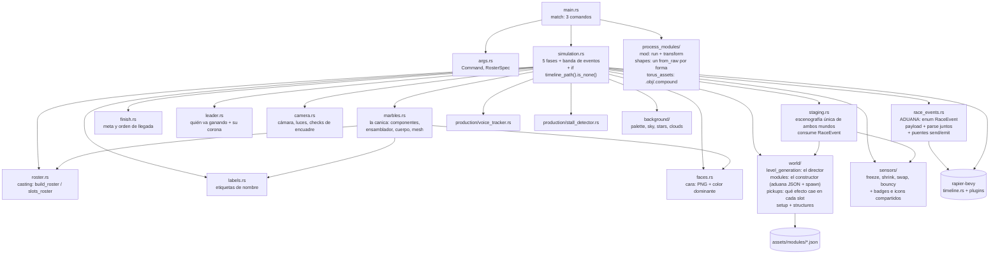

# Flujos del repo

Diagramas vivos. Cuando el código cambie, corre `/update-flow` y Claude actualiza esto.

## 1. Flowchart de `main`

`simulation.rs` es el flowchart del juego: cinco fases con nombre de momento
(`on_start` → `on_step` → `on_frame_update` → `after_frame_update` → `on_exit`)
y una sola rama. Cmd+click sobre cualquier system salta a su implementación.

`--bench` no es modo del juego. Para correrlo: `cd ../rapier-bevy && cargo run -- --bench falling-spheres 200`.

## 2. Composición engine ↔ juego

El engine no conoce a ningún juego: mueve cuerpos, escribe y actúa timelines,
y transporta eventos como sobres opacos. Cada juego pone su cámara, sus
sistemas y su vocabulario (`RaceEvent`).

## 3. Pipeline editor → juego

## 4. Pipeline producción de video (write-timeline anónimo → casting → play vestido)

Este repo es **uno de los dos juegos** que orquesta `~/canicasbrawl-production`
(el otro es `~/musical-path-rapier`). El contrato: producir timeline +
voice_tracker (write-timeline) y un mp4 crudo (record); todo lo demás (covers
RVC, mezcla, subtítulos, card, B2, publicación) vive en production.

Detalle del contrato en la sección "Contrato bake/replay" de `CLAUDE.md` y el
contrato de datos en `../rapier-bevy/src/timeline.rs`.

## 5. Pipeline general (materializado en canicasbrawl-production)

El "pipeline futuro" que vivía aquí ya existe: es el repo
`~/canicasbrawl-production` (discovery → planner → runs → audio → video →
publisher, con feedback de métricas al planner). Sus diagramas viven en
`~/canicasbrawl-production/docs/flow.md`; este repo solo aporta el área `runs`.

## 6. Módulos del juego

`simulation.rs` referencia cada system por su ruta completa
(`game::sensors::freeze::on_freeze_contact`, `game::staging::stage_race_events`,
...). Los `mod.rs` son índices puros — sin Plugins ni funciones de composición.
