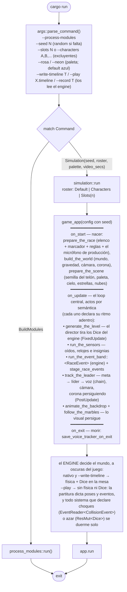
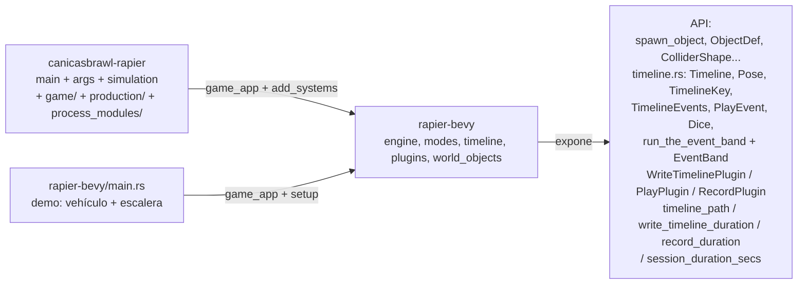
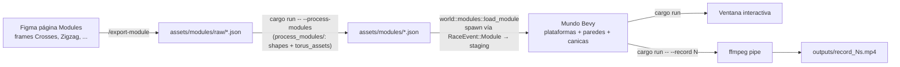
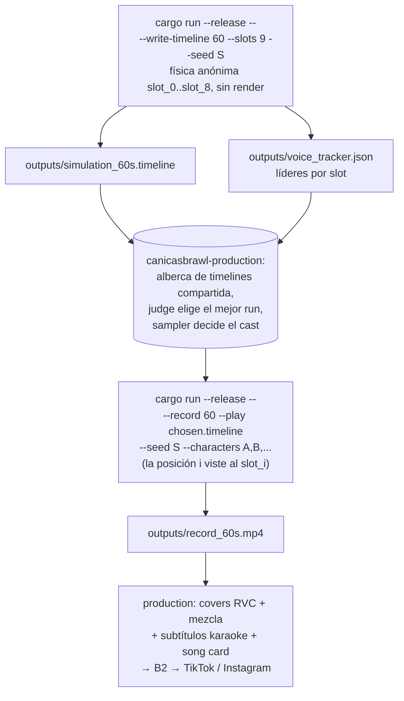
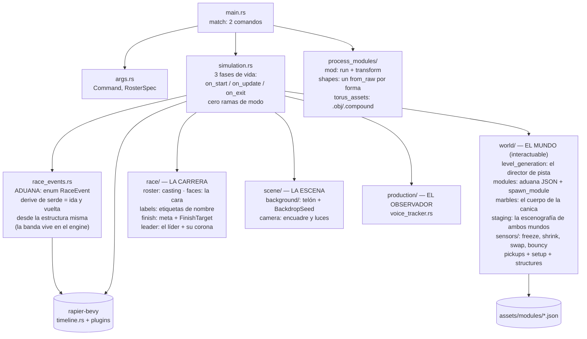

# Flujos del repo

Diagramas vivos. Cuando el código cambie, corre `/update-flow` y Claude actualiza esto.

## 1. Flowchart de `main`

`simulation.rs` es la vida del juego en tres fases (`on_start` → `on_update` →
`on_exit`), sin una sola rama de modos: el juego declara necesidades y el
engine arma la mesa. Cmd+click sobre cualquier system salta a su implementación.

Asinceramiento 2026-07-15: `--preprocess`, `--sim-raw`, `--debug` y `--bench`
murieron (nunca se usaban; git los guarda). Los colisionadores de malla vienen
SIEMPRE de `.compound` — quien fabrica el asset fabrica su compound.

## 2. Composición engine ↔ juego

El engine no conoce a ningún juego: mueve cuerpos, escribe y actúa timelines,
pone (o no) los Dice en la mesa, y toca la banda de eventos completa — el
juego solo aporta su aduana (`#[derive(Event, Serialize, Deserialize)]` en su enum) y
su escenografía. En `--play` duerme, por necesidad ausente, a todo sistema que
declare choques o azar: el juego jamás pregunta por modos.

## 3. Pipeline editor → juego

## 4. Pipeline producción de video (write-timeline anónimo → casting → play vestido)

Este repo es **uno de los dos juegos** que orquesta `~/canicasbrawl-production`
(el otro es `~/musical-path-rapier`). El contrato: producir timeline +
voice_tracker (write-timeline) y un mp4 crudo (record); todo lo demás (covers
RVC, mezcla, subtítulos, card, B2, publicación) vive en production.

Detalle del contrato en la sección "Contrato bake/replay" de `CLAUDE.md` y el
contrato de datos en `../rapier-bevy/src/timeline.rs`.

## 5. Pipeline general (materializado en canicasbrawl-production)

El "pipeline futuro" que vivía aquí ya existe: es el repo
`~/canicasbrawl-production` (discovery → planner → runs → audio → video →
publisher, con feedback de métricas al planner). Sus diagramas viven en
`~/canicasbrawl-production/docs/flow.md`; este repo solo aporta el área `runs`.

## 6. Módulos del juego

`simulation.rs` referencia cada system por su ruta completa
(`game::sensors::freeze::on_freeze_contact`, `game::staging::stage_race_events`,
...). Los `mod.rs` son índices puros — sin Plugins ni funciones de composición.
